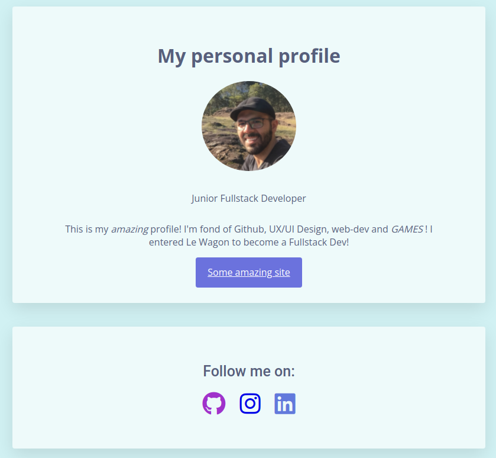

<!-- PROJECT LOGO -->
 

<h3 align="center">First simple website</h3>

  

    A really simple website made by myself at Le Wagon's Bootcamp
     
     
    <a href="https://github.com/PeterDve/My-profile"><strong>Explore the docs »</strong></a>
     
     
  

<!-- TABLE OF CONTENTS -->

  
Table of Contents

  <ol>
    <li>
      <a href="#about-the-project">About The Project</a>
      <ul>
        <li><a href="#built-with">Built With</a></li>
      </ul>
    </li>
    <li><a href="#usage">Usage</a></li>
    <li><a href="#roadmap">Roadmap</a></li>
    <li><a href="#contact">Contact</a></li>
    <li><a href="#acknowledgments">Acknowledgments</a></li>
  </ol>

<!-- ABOUT THE PROJECT -->

## About The Project

  

    

 

  

  This was my first project using HTML and CSS to build a simple personal page.

  

(<a href="#top">back to top</a>)

### Built With

- HTML
- CSS
- [Font Awesome](https://fontawesome.com)

(<a href="#top">back to top</a>)

<!-- USAGE EXAMPLES -->

## Usage

Use this space to show useful examples of how a project can be used. Additional screenshots, code examples and demos work well in this space. You may also link to more resources.

_For more examples, please refer to the [Documentation](https://example.com)_

(<a href="#top">back to top</a>)

<!-- ROADMAP -->

## Roadmap

Well... There isn't one. I'm not gonna be updating this website. It's just here since it was my first. haha.
Sometime in the future I'll make a real one, but for now, since I'm focusing solely on backend developing, it'll take some time.

(<a href="#top">back to top</a>)

<!-- LICENSE -->

## License

There is none. Use it if you feel like it!

(<a href="#top">back to top</a>)

<!-- CONTACT -->

## Contact

Pedro Barbosa - [LinkedIn](https://www.linkedin.com/in/pvbb250689/?locale=en_US)

Project Link: [https://github.com/PeterDve/My-profile](https://github.com/PeterDve/My-profile)

(<a href="#top">back to top</a>)

<!-- ACKNOWLEDGMENTS -->

## Acknowledgments

- [Le Wagon](https://www.lewagon.com)

(<a href="#top">back to top</a>)

